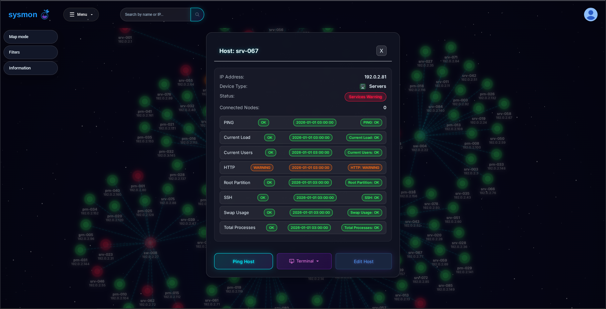
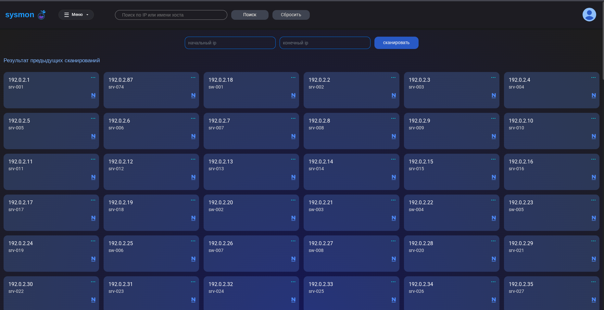

# Sysmon

Sysmon is a Django-based network node inventory and monitoring system. The project includes a network map, SNMP discovery, Nagios integration, microsegmentation, and a browser-based SSH terminal through Django Channels.

## Screenshots

### Network Map


### Display Controls and Filters


### Host Statuses



### Logs


### New Host Discovery



### Sign In


## Docker

Docker Engine and Docker Compose are required.

```bash
cp .env.example .env
docker compose build
docker compose run --rm setup
docker compose up -d
```

The application will be available at <http://127.0.0.1:8000/>. The `web` container automatically applies migrations and collects static files. PostgreSQL, Redis, user uploads, and collected static files are stored in named volumes.

The `setup` command interactively asks for the administrator username, optional email, password with confirmation, and a choice between demo data and an empty inventory. The password is hidden during entry and is not saved to `.env`, Compose configuration, or shell history. Only its hash is stored in PostgreSQL.

Running `setup` again is not required. To create another administrator later, run `docker compose exec web python itproger/manage.py createsuperuser`.

Main commands:

```bash
docker compose ps
docker compose logs -f web
docker compose exec web python itproger/manage.py check
docker compose down
```

`docker compose down -v` also removes volumes and the database.

## Nagios Synchronization

The application reads `status.dat` and `nagios.log` from the directory specified by `NAGIOS_STATUS_HOST_DIR`. In Docker, this directory is mounted into the container read-only. By default, `./nagios_stat` next to `compose.yaml` is used.

On the application server, create a dedicated SSH key for fetching files:

```bash
mkdir -p ~/.ssh
ssh-keygen -t ed25519 -f ~/.ssh/sysmon_nagios -C sysmon-nagios-sync
ssh-copy-id -i ~/.ssh/sysmon_nagios.pub nagios-reader@nagios.example.org
ssh -i ~/.ssh/sysmon_nagios nagios-reader@nagios.example.org true
```

On the first connection, verify the Nagios server fingerprint with the administrator. Do not add the private key or the contents of `nagios_stat` to Git. The `nagios-reader` user only needs read permissions for the required files.

Create the destination directory:

```bash
sudo install -d -o "$USER" -g "$USER" -m 755 /srv/sysmon/nagios_stat
```

Example cron job for atomically updating the files once per minute:

```cron
* * * * * flock -n /tmp/sysmon-nagios-sync.lock sh -c 'scp -q -i "$HOME/.ssh/sysmon_nagios" nagios-reader@nagios.example.org:/usr/local/nagios/var/status.dat /srv/sysmon/nagios_stat/status.dat.new && mv /srv/sysmon/nagios_stat/status.dat.new /srv/sysmon/nagios_stat/status.dat && scp -q -i "$HOME/.ssh/sysmon_nagios" nagios-reader@nagios.example.org:/usr/local/nagios/var/nagios.log /srv/sysmon/nagios_stat/nagios.log.new && mv /srv/sysmon/nagios_stat/nagios.log.new /srv/sysmon/nagios_stat/nagios.log'
```

Replace paths and the user with your Nagios settings. In the application server `.env`, set:

```dotenv
NAGIOS_STATUS_HOST_DIR=/srv/sysmon/nagios_stat
SYSMON_ENABLE_SCHEDULER=true
```

The scheduler reads a fresh copy of `status.dat` once per minute. Checking the Nagios server itself over SSH runs only when `NAG_SERVER` is set.

After the first copy, verify container access:

```bash
docker compose exec web ls -l /app/nagios_stat
```

The variables `NAG_SERVER`, `NAG_USERNAME`, and `NAG_PASSWORD` are only needed by functions that modify Nagios configuration over SSH. For one-way file imports via cron, they can be left empty.

## Local Run

Python 3.12 is required.

### Linux and macOS

```bash
python3.12 -m venv .venv
.venv/bin/python -m pip install --upgrade pip
.venv/bin/python -m pip install -r requirements/dev.txt
cp .env.example .env
.venv/bin/python itproger/manage.py migrate
.venv/bin/python -m uvicorn itproger.asgi:application --app-dir itproger --reload
```

### Windows PowerShell

```powershell
py -3.12 -m venv .venv
.\.venv\Scripts\python.exe -m pip install --upgrade pip
.\.venv\Scripts\python.exe -m pip install -r requirements\dev.txt
Copy-Item .env.example .env
.\.venv\Scripts\python.exe itproger\manage.py migrate
.\.venv\Scripts\python.exe -m uvicorn itproger.asgi:application --app-dir itproger --reload
```

Without Docker, SQLite and in-memory Channels are used. The local graphical terminal is available only in this mode; in Docker, use the browser-based WebSocket terminal.

## Data and Utility Commands

Load the demo dataset manually:

```bash
.venv/bin/python itproger/manage.py loaddata demo_hosts
```

The fixture contains 163 anonymized hosts, 100 services, and 163 map positions. RFC 5737 documentation networks are used for IP addresses, and hostnames are generated.

Rebuild the fixture from a directory with `status.dat` and optional `scan-stat.txt`:

```bash
.venv/bin/python itproger/manage.py build_demo_fixture /path/to/nagios_stat
```

Source files are not modified and are not copied into the repository.

Discover topology through SNMP:

```bash
.venv/bin/python itproger/manage.py discover_network 192.0.2.1 --community public
```

Audit microsegmentation policies:

```bash
.venv/bin/python itproger/manage.py audit_segments
.venv/bin/python itproger/manage.py audit_segments --protocol tcp --port 443
```

For CI, the `audit_segments --fail-on-violations` flag is available. Rules are applied in ascending `priority` order; the first matching rule determines the result.

## Configuration

Local settings are defined in `.env`; `.env.example` contains the full list of variables. `.env`, databases, uploads, logs, and keys must not be committed to Git.

Main setting groups:

- `DJANGO_*` — Django, database, HTTPS, and trusted hosts;
- `POSTGRES_*`, `REDIS_URL` — PostgreSQL and Redis;
- `NAG_*` — Nagios connection;
- `SYSMON_SNMP_*` — SNMP settings;
- `SYSMON_MAIL_*` — mail notifications;
- `SYSMON_ENABLE_SCHEDULER` — built-in scheduler;
- `DJANGO_ENABLE_LDAP` — LDAP after installing `requirements/ldap.txt`.

For production, set `DJANGO_DEBUG=false`, a long random `DJANGO_SECRET_KEY`, real `DJANGO_ALLOWED_HOSTS`, and `DJANGO_CSRF_TRUSTED_ORIGINS`. Enable HTTPS settings after configuring the reverse proxy. HSTS should be enabled only after verifying stable HTTPS operation.

## Checks

```bash
.venv/bin/python itproger/manage.py check
.venv/bin/python itproger/manage.py makemigrations --check --dry-run
.venv/bin/python itproger/manage.py test accounts hosting main stream
.venv/bin/python -m ruff check itproger
```

## Structure

- `itproger/itproger/` — settings and ASGI;
- `itproger/hosting/` — inventory, map, monitoring, and terminal;
- `itproger/accounts/` — authentication;
- `itproger/stream/` — background checks;
- `requirements/` — dependency sets.
