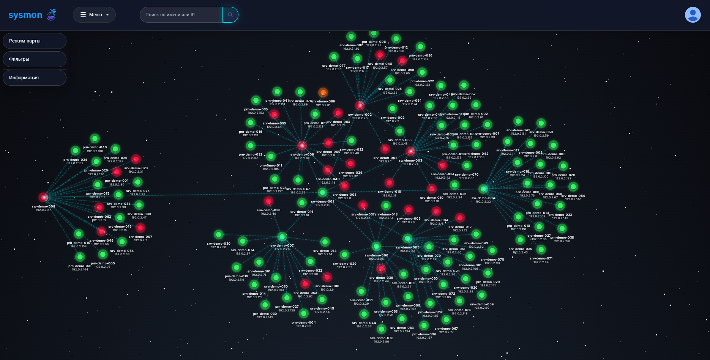
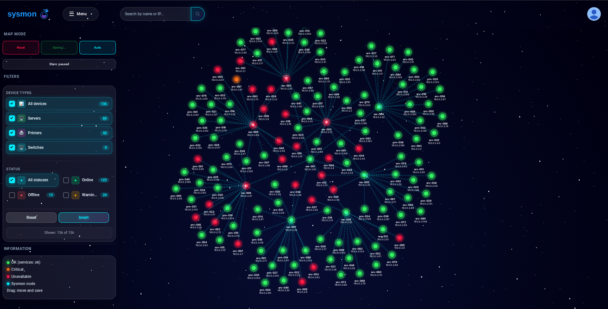
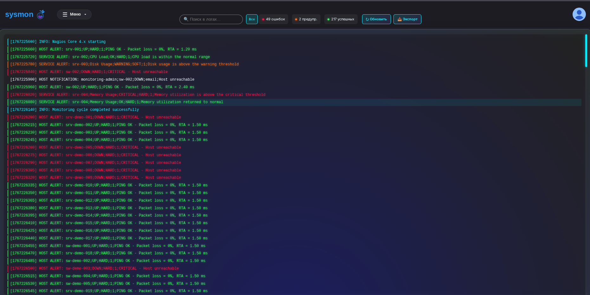

# Sysmon

Система инвентаризации и мониторинга сетевых узлов на Django. В проект входят
карта сети, SNMP-обнаружение, интеграция с Nagios, микросегментация и браузерный
SSH-терминал через Django Channels.

## Скриншоты

### Карта сети



### Управление отображением и фильтры



### Логи



### Авторизация


## Docker

Требуются Docker Engine и Docker Compose.

```bash
cp .env.example .env
docker compose build
docker compose run --rm setup
docker compose up -d
```

Приложение будет доступно по адресу <http://127.0.0.1:8000/>. Контейнер `web`
самостоятельно применяет миграции и собирает статику. PostgreSQL, Redis,
пользовательские загрузки и собранная статика хранятся в именованных volumes.

Команда `setup` интерактивно запрашивает имя администратора, необязательный
email, пароль с подтверждением и выбор между тестовыми данными и пустым инвентарём.
Пароль при вводе не отображается и не сохраняется в `.env`, конфигурации
Compose или истории команд. В PostgreSQL сохраняется только его хеш.

Повторный запуск `setup` не требуется. Чтобы позднее создать другого
администратора, выполните `docker compose exec web python
itproger/manage.py createsuperuser`.

Основные команды:

```bash
docker compose ps
docker compose logs -f web
docker compose exec web python itproger/manage.py check
docker compose down
```

`docker compose down -v` дополнительно удаляет volumes и базу данных.

## Синхронизация с Nagios

Приложение читает `status.dat` и `nagios.log` из каталога, указанного в
`NAGIOS_STATUS_HOST_DIR`. В Docker этот каталог подключается к контейнеру
только для чтения. По умолчанию используется `./nagios_stat` рядом с
`compose.yaml`.

На сервере приложения создайте отдельный SSH-ключ для получения файлов:

```bash
mkdir -p ~/.ssh
ssh-keygen -t ed25519 -f ~/.ssh/sysmon_nagios -C sysmon-nagios-sync
ssh-copy-id -i ~/.ssh/sysmon_nagios.pub nagios-reader@nagios.example.org
ssh -i ~/.ssh/sysmon_nagios nagios-reader@nagios.example.org true
```

При первом подключении сверьте fingerprint сервера Nagios с данными
администратора. Закрытый ключ и содержимое `nagios_stat` не добавляйте в Git.
Пользователю `nagios-reader` достаточно прав только на чтение нужных файлов.

Создайте каталог назначения:

```bash
sudo install -d -o "$USER" -g "$USER" -m 755 /srv/sysmon/nagios_stat
```

Пример cron-задачи для атомарного обновления файлов раз в минуту:

```cron
* * * * * flock -n /tmp/sysmon-nagios-sync.lock sh -c 'scp -q -i "$HOME/.ssh/sysmon_nagios" nagios-reader@nagios.example.org:/usr/local/nagios/var/status.dat /srv/sysmon/nagios_stat/status.dat.new && mv /srv/sysmon/nagios_stat/status.dat.new /srv/sysmon/nagios_stat/status.dat && scp -q -i "$HOME/.ssh/sysmon_nagios" nagios-reader@nagios.example.org:/usr/local/nagios/var/nagios.log /srv/sysmon/nagios_stat/nagios.log.new && mv /srv/sysmon/nagios_stat/nagios.log.new /srv/sysmon/nagios_stat/nagios.log'
```

Пути и пользователя замените на настройки своего Nagios. В `.env` сервера
приложения укажите:

```dotenv
NAGIOS_STATUS_HOST_DIR=/srv/sysmon/nagios_stat
SYSMON_ENABLE_SCHEDULER=true
```

Планировщик раз в минуту читает новую копию `status.dat`. Проверка самого
сервера Nagios по SSH запускается только при заполненном `NAG_SERVER`.

После первого копирования проверьте доступ контейнера:

```bash
docker compose exec web ls -l /app/nagios_stat
```

Переменные `NAG_SERVER`, `NAG_USERNAME` и `NAG_PASSWORD` нужны только функциям,
которые изменяют конфигурацию Nagios по SSH. Для одного импорта файлов через
cron их можно оставить пустыми.

## Локальный запуск

Требуется Python 3.12.

### Linux и macOS

```bash
python3.12 -m venv .venv
.venv/bin/python -m pip install --upgrade pip
.venv/bin/python -m pip install -r requirements/dev.txt
cp .env.example .env
.venv/bin/python itproger/manage.py migrate
.venv/bin/python -m uvicorn itproger.asgi:application --app-dir itproger --reload
```

### Windows PowerShell

```powershell
py -3.12 -m venv .venv
.\.venv\Scripts\python.exe -m pip install --upgrade pip
.\.venv\Scripts\python.exe -m pip install -r requirements\dev.txt
Copy-Item .env.example .env
.\.venv\Scripts\python.exe itproger\manage.py migrate
.\.venv\Scripts\python.exe -m uvicorn itproger.asgi:application --app-dir itproger --reload
```

Без Docker используются SQLite и in-memory Channels. Локальный графический
терминал доступен только в этом режиме; в Docker используйте браузерный
WebSocket-терминал.

## Данные и служебные команды

Загрузить тестовый набор данных вручную:

```bash
.venv/bin/python itproger/manage.py loaddata demo_hosts
```

Fixture содержит 163 обезличенных хоста, 100 сервисов и 163 позиции карты. Для
IP-адресов используются документационные сети RFC 5737, имена узлов
сгенерированы.

Пересобрать fixture из каталога с `status.dat` и необязательным
`scan-stat.txt`:

```bash
.venv/bin/python itproger/manage.py build_demo_fixture /path/to/nagios_stat
```

Исходные файлы не изменяются и не копируются в репозиторий.

Обнаружить топологию через SNMP:

```bash
.venv/bin/python itproger/manage.py discover_network 192.0.2.1 --community public
```

Проверить политики микросегментации:

```bash
.venv/bin/python itproger/manage.py audit_segments
.venv/bin/python itproger/manage.py audit_segments --protocol tcp --port 443
```

Для CI доступен флаг `audit_segments --fail-on-violations`. Правила применяются
по возрастанию `priority`; первое совпавшее правило определяет результат.

## Настройка

Локальные параметры задаются в `.env`; файл `.env.example` содержит полный
список переменных. `.env`, базы, загрузки, журналы и ключи не должны попадать в
Git.

Основные группы настроек:

- `DJANGO_*` — Django, база, HTTPS и доверенные адреса;
- `POSTGRES_*`, `REDIS_URL` — PostgreSQL и Redis;
- `NAG_*` — подключение к Nagios;
- `SYSMON_SNMP_*` — параметры SNMP;
- `SYSMON_MAIL_*` — почтовые уведомления;
- `SYSMON_ENABLE_SCHEDULER` — встроенный планировщик;
- `DJANGO_ENABLE_LDAP` — LDAP после установки `requirements/ldap.txt`.

Для публикации задайте `DJANGO_DEBUG=false`, длинный случайный
`DJANGO_SECRET_KEY`, реальные `DJANGO_ALLOWED_HOSTS` и
`DJANGO_CSRF_TRUSTED_ORIGINS`. HTTPS-параметры включайте после настройки reverse
proxy. HSTS следует включать только после проверки постоянной работы HTTPS.

## Проверки

```bash
.venv/bin/python itproger/manage.py check
.venv/bin/python itproger/manage.py makemigrations --check --dry-run
.venv/bin/python itproger/manage.py test accounts hosting main stream
.venv/bin/python -m ruff check itproger
```

## Структура

- `itproger/itproger/` — настройки и ASGI;
- `itproger/hosting/` — инвентарь, карта, мониторинг и терминал;
- `itproger/accounts/` — аутентификация;
- `itproger/stream/` — фоновые проверки;
- `requirements/` — наборы зависимостей.
